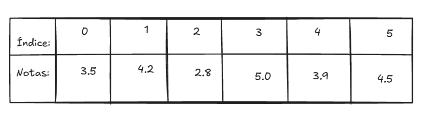
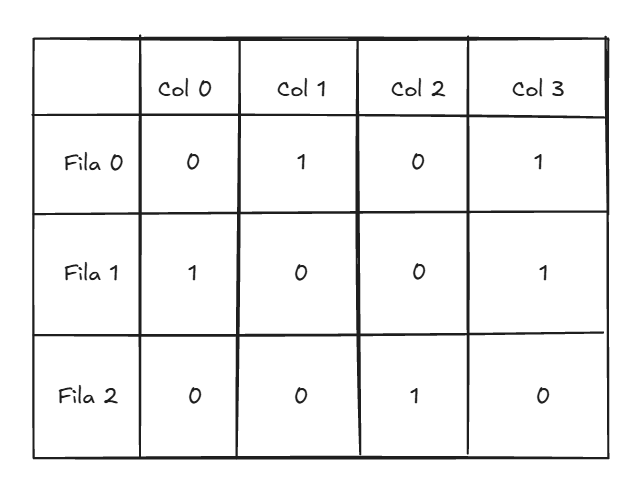
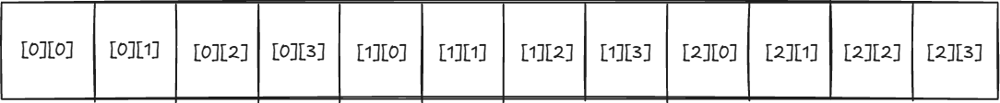

**Taller --- Complejidad algorítmica y Arreglos**

**SD1004 · Estructura de Datos** --- Institución Universitaria Pascual Bravo Docente: Juan Duque · Semestre 2026-II Cubre: Clase 2 (Big O) · Clase 3 (Arreglos 1D) · Clase 4 (Arreglos 2D)

**Instrucciones generales**

-   Responde directamente en este documento (edítalo en Word, Markdown o entrégalo en PDF).

-   No necesitas escribir código en ningún lenguaje: usa pseudocódigo, dibujos o explicaciones en tus propias palabras. Lo que se evalúa es el razonamiento, no la sintaxis.

-   Donde se pida un dibujo (arreglos, memoria), puedes hacerlo a mano y adjuntar una foto, o usar draw.io.

-   Justifica siempre tu respuesta --- una respuesta correcta sin justificación no cuenta completa.

-   Fecha y forma de entrega: la indicada en el aula/repositorio del curso.

**Parte 1 --- Complejidad algorítmica (Big O)**

**1.1 Clasifica la complejidad**

Para cada situación, indica si corresponde a **O(1)**, **O(log n)**, **O(n)** o **O(n²)**, y explica por qué usando tus propias palabras (no hace falta fórmula matemática).

1.  Buscar una palabra en un diccionario físico, abriendo siempre por la mitad de las páginas que quedan.\
    \
    R: **O(log n).** Vas descartando la mitad de las páginas cada vez, como búsqueda binaria.

2.  Revisar, uno por uno, cada carné en una caja de carnés de estudiantes hasta encontrar el que buscas.\
    \
    R: **O(n).** En el peor caso revisas todos los carnés uno por uno.

3.  Sacar la primera carta de un mazo ya barajado.\
    \
    R: **O(1)**. La carta de arriba siempre está ahí, no depende de cuántas cartas haya.

4.  Comparar cada estudiante de un salón con cada uno de los demás estudiantes, para ver si algún par cumple años el mismo día.\
    \
    R: **O(n²)**. Cada estudiante se compara con todos los demás, son comparaciones \"en pareja\".

5.  Consultar la hora en tu reloj.\
    \
    R: **O(1)**. Ver la hora no depende de nada más, siempre es inmediato.

**1.2 De la vida real al análisis**

Piensa en una tarea cotidiana (que no sea de las ya usadas en clase) que hagas de forma **O(n)** --- es decir, que si la cantidad de elementos se duplica, el tiempo que tardas también se duplica.

-   Descríbela en 2-3 líneas.

-   Explica qué pasaría si la \"entrada\" (n) se hiciera 10 veces más grande.\
    \
    R: Cada vez que lavo la ropa de mi casa, reviso prenda por prenda si tiene manchas antes de meterla a la lavadora. Si tengo el doble de ropa, me demoro el doble revisando, por eso es O(n).

> Si n se hace 10 veces más grande, el tiempo también se multiplica por 10 (más o menos), porque sigo revisando una por una. 

**1.3 ¿Cuál escalar mejor?**

Tienes dos formas de resolver el mismo problema:

-   Forma A: O(n²)

-   Forma B: O(n log n)\
    \
    R: Usaría la Forma B "O(n log n)", porque, aunque para "n" pequeño la O(n²) gane, a medida que n crece la O(n²) se dispara mucho más rápido. Como no sé qué tan grande será n en el futuro, es más seguro usar la que escala mejor.

Para un conjunto pequeño de datos (n = 5), la Forma A es más rápida en la práctica. Aun así, ¿cuál recomendarías usar si no sabes qué tan grande será n en el futuro? Justifica tu respuesta pensando en qué pasa a medida que n crece.

**1.4 Verdadero o falso (justifica siempre)**

a\. Un algoritmo O(1) siempre es más rápido en segundos reales que uno O(n). b. La notación Big O describe cómo crece el tiempo de ejecución a medida que crecen los datos, no el tiempo exacto en segundos. c. Buscar por índice en un arreglo (arreglo\[5\]) es O(n), porque hay que recorrer los primeros 5 elementos.\
\
a. Un algoritmo O(1) siempre es más rápido en segundos reales que uno O(n).\
\
b. La notación Big O describe cómo crece el tiempo de ejecución a medida que crecen los datos, no el tiempo exacto en segundos.\
\
c. Buscar por índice en un arreglo (arreglo\[5\]) es O(n), porque hay que recorrer los primeros 5 elementos.

**Parte 2 --- Arreglos 1D**

**2.1 Diseña el arreglo**

Vas a guardar las calificaciones de 6 estudiantes de un curso en un arreglo llamado notas.

1.  Dibuja el arreglo con sus 6 casillas, mostrando el índice de cada una (recuerda: empieza en 0).\
    \
    R: 

2.  Si notas = \[3.5, 4.2, 2.8, 5.0, 3.9, 4.5\], ¿qué valor y qué índice tiene la tercera nota que ingresaste?\
    \
    R:\
    \
    Índice: 2\
    Valor: 2.8

3.  ¿Cuál es la instrucción (en pseudocódigo) para acceder directamente a la nota del último estudiante sin recorrer el arreglo?\
    \
    R:\
    \
    notas\[5\]. Si no conociéramos la longitud exacta del arreglo, tendríamos: notas\[longitud - 1\]

**2.2 Direcciones de memoria**

Supón que el arreglo notas del punto anterior se guarda en memoria RAM empezando en la dirección **0x2000**, y cada valor ocupa **4 bytes**.

1.  Calcula la dirección de memoria de notas\[0\], notas\[3\] y notas\[5\], usando la fórmula:

> dirección = base + (índice × tamaño)\
> \
> R:\
> notas\[0\] = 0x2000 + (0×4) = 0x2000
>
> notas\[3\] = 0x2000 + (3×4) = 0x2000 + 12 = 0x200C
>
> notas\[5\] = 0x2000 + (5×4) = 0x2000 + 20 = 0x2014 

2.  Explica en tus palabras por qué acceder a notas\[3\] es igual de rápido que acceder a notas\[0\] --- no importa cuál pidas, es O(1).\
    \
    R: Es O(1) porque no importa el índice, la dirección se calcula con una multiplicación y una suma; no hay que \"caminar\" por el arreglo para llegar hasta ahí.

**2.3 Búsqueda lineal vs. binaria**

Tienes el arreglo ordenado edades = \[15, 18, 20, 23, 27, 31, 35, 40\].

1.  Simula paso a paso una **búsqueda lineal** para encontrar el valor 31. ¿Cuántas comparaciones hiciste?\
    \
    R: Búsqueda lineal por 31: comparo 15, 18, 20, 23, 27, 31. Lo encuentro en la sexta comparación.

2.  Simula paso a paso una **búsqueda binaria** para encontrar el mismo valor 31. ¿Cuántas comparaciones hiciste?\
    \
    R:\
    Búsqueda binaria por 31.\
    Mitad: índice 3 (23) → 31 \> 23, busco a la derecha.\
    Mitad de la derecha: índice 5 (31) → lo encontré → 2 comparaciones.

3.  ¿Por qué la búsqueda binaria solo funciona si el arreglo ya está ordenado?\
    \
    R: Porque la búsqueda binaria descarta mitades asumiendo que si un valor es mayor o menor, sabe hacia qué lado ir. Si no está ordenado, esa suposición no sirve.

4.  Si el arreglo tuviera 1 millón de elementos, ¿cuál de las dos búsquedas seguirías usando? Justifica con lo visto sobre O(n) vs. O(log n).\
    \
    R: Con 1 millón de elementos usaría binaria, porque O(log n) para un millón son como 20 comparaciones, mientras que lineal en el peor caso serían un millón de comparaciones.

**2.4 Insertar un elemento**

Tienes edades = \[15, 18, 20, 23, 27\] (5 casillas, sin espacio libre).

1.  ¿Qué tan costoso es insertar un nuevo valor **al final**, si hay espacio disponible? ¿Y si no hay espacio y hay que crear un arreglo más grande?\
    \
    R: Insertar al final con espacio libre: O(1). Si no hay espacio, toca crear un arreglo más grande y copiar todo: O(n).

2.  ¿Qué tan costoso es insertar el valor 21 **en la mitad** (para que quede ordenado)? Explica qué hay que hacer con los demás elementos.\
    \
    R: Insertar 21 en la mitad: O(n), porque hay que correr todos los elementos después de esa posición un puesto a la derecha para hacer espacio.

3.  Compara ambos casos usando notación Big O.\
    \
    R: Al final (con espacio): O(1). En la mitad: O(n). Sin espacio al final: O(n) también, por la copia.

**Parte 3 --- Arreglos 2D**

**3.1 Diseña la matriz**

Vas a guardar la disposición de un salón de clase de 3 filas x 4 columnas, donde cada casilla indica si el puesto está ocupado (1) o libre (0).

1.  Dibuja la matriz salon con sus 3 filas y 4 columnas, con los índices \[fila\]\[columna\] de cada casilla.\
    \
    R:\
    \
    

2.  Escribe (en pseudocódigo) cómo accedes al puesto de la fila 2, columna 3.\
    \
    R:\
    \
    \
    INICIO\
    \
    DECLARAR puesto\
    \
    puesto ← salon\[2\]\[3\]\
    \
    ESCRIBIR \"El valor del puesto en fila 2, columna 3 es: \", puesto\
    \
    FIN

3.  ¿Cuántas casillas tiene en total esta matriz? ¿Cómo lo calculas en general para filas × columnas?\
    \
    R: 3 × 4 = 12 casillas. En general: filas × columnas.

**3.2 De 2D a memoria (row-major)**

La memoria RAM es una sola fila continua de casillas --- no existen \"filas y columnas\" físicamente en la RAM. Por eso una matriz se guarda \"aplanada\", fila por fila.

Supón que salon (3 filas x 4 columnas) se guarda empezando en la dirección **0x1000**, con cada valor ocupando **4 bytes**, en orden por filas (row-major).

1.  Dibuja cómo quedarían las 12 casillas de salon en una sola fila de memoria (aplanadas).\
    \
    R:\
    

2.  Calcula la dirección de memoria de la casilla \[1\]\[2\], usando la fórmula:

> dirección = base + ((fila × número_de_columnas + columna) × tamaño)\
> \
> R:
>
> \[1\]\[2\] = 0x1000 + ((1×4+2)×4) = 0x1000 + 24 = 0x1018

3.  Calcula también la dirección de \[0\]\[0\] y de \[2\]\[3\] (la última casilla).\
    \
    R:\
    \
    \[0\]\[0\] = 0x1000 + ((0×4+0)×4) = 0x1000\
    \[2\]\[3\] = 0x1000 + ((2×4+3)×4) = 0x1000 + 44 = 0x102C

**3.3 Recorrido con ciclos anidados**

Quieres contar cuántos puestos están ocupados (1) en toda la matriz salon.

1.  Describe en pseudocódigo el recorrido usando dos ciclos anidados (uno para filas, otro para columnas).\
    R:\
    contador = 0\
    para fila desde 0 hasta f-1:\
    para columna desde 0 hasta c-1:\
    si salon\[fila\]\[columna\] == 1:\
    contador = contador + 1

2.  Si la matriz tiene f filas y c columnas, ¿cuál es la complejidad de este recorrido en notación Big O? Explica por qué.\
    \
    R: Es O(f × c), porque por cada fila recorro todas las columnas, entonces son f×c pasos en total.

3.  ¿Qué pasaría con el tiempo de ejecución si f y c se duplican ambos a la vez?\
    \
    R: Si f y c se duplican ambos, el tiempo se multiplica por 4 (2×2), no solo por 2.

**3.4 Conectando todo**

En un párrafo corto (5-8 líneas), explica con tus propias palabras la relación entre estos tres conceptos vistos en las últimas tres clases: **Big O**, **arreglos 1D** y **arreglos 2D**. Pista: piensa en por qué entender la complejidad te ayuda a decidir cuándo usar un arreglo 1D, cuándo una matriz, y cuándo buscar de forma lineal o binaria.\
\
R: Big O me ayuda a saber qué tan bien escala una solución antes de que el problema crezca demasiado. Un arreglo 1D sirve para datos simples en una sola secuencia, y ahí puedo elegir búsqueda lineal (O(n)) o binaria (O(log n)) si está ordenado. Cuando los datos tienen dos dimensiones, como una matriz o tabla, uso un arreglo 2D, pero recorrerlo completo ya implica O(f×c), que crece más rápido. Entender esto me sirve para decidir qué estructura usar y qué tipo de búsqueda me conviene según el tamaño de los datos.
